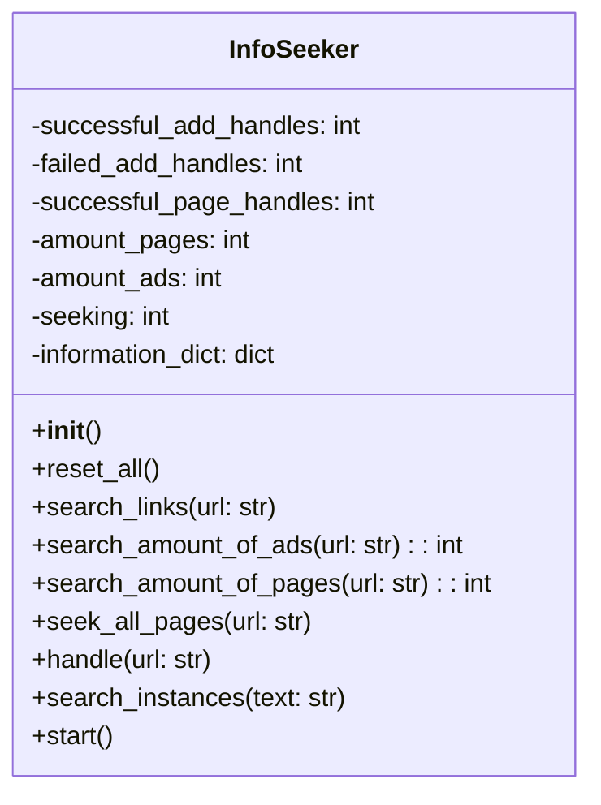

# Arkkitehtuuri

```mermaid
classDiagram
    class InfoSeeker{
        -successful_add_handles: int
        -failed_add_handles: int
        -successful_page_handles: int
        -amount_pages: int
        -amount_ads: int
        -seeking: int
        -information_dict: dict
        +__init__()
        +reset_all()
        +search_links(url: str)
        +search_amount_of_ads(url: str): int
        +search_amount_of_pages(url: str): int
        +seek_all_pages(url: str)
        +handle(url: str)
        +search_instances(text: str)
        +start()
    }
```
    
