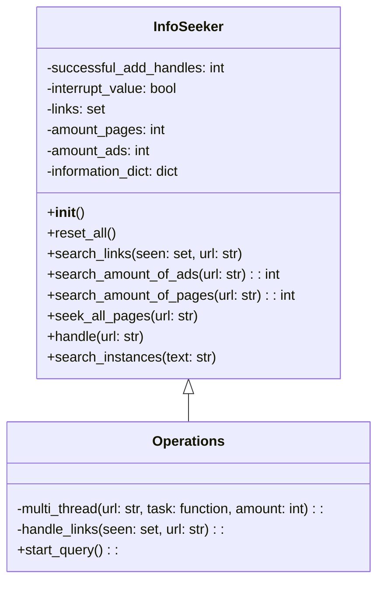
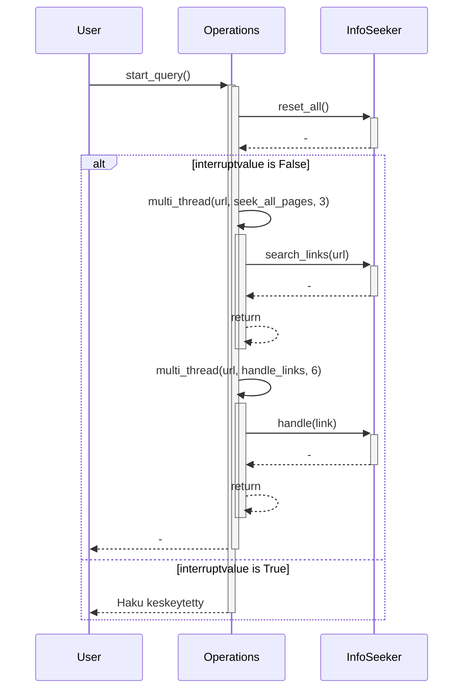

# Arkkitehtuuri

## Rakenne
koodin rakenne pakkauskaaviona:

## Sovelluksen toiminnasta vastaavat luokat sekvenssikaaviona

```mermaid
classDiagram
    class InfoSeeker{
        -successful_add_handles: int
        -interrupt_value: bool
        -links: set
        -amount_pages: int
        -amount_ads: int
        -information_dict: dict
        +__init__()
        +reset_all()
        +search_links(seen: set, url: str)
        +search_amount_of_ads(url: str): int
        +search_amount_of_pages(url: str): int
        +seek_all_pages(url: str)
        +handle(url: str)
        +search_instances(text: str)
    }
    class Operations{
        -multi_thread(url: str, task: function, amount: int):
        -handle_links(seen: set, url: str):
        +start_query():
    }

    InfoSeeker <|-- Operations
    
```
## Sovelluksen toiminta kuvattuna sekvenssikaaviolla

```mermaid
sequenceDiagram
    participant User
    participant Operations
    participant InfoSeeker
    User->>+Operations: start_query()
    activate Operations
    Operations->>+InfoSeeker: reset_all()
    InfoSeeker-->>-Operations: -
    alt interruptvalue is False
        Operations->>+Operations: multi_thread(url, seek_all_pages, 3)
        activate Operations
        Operations->>+InfoSeeker: search_links(url)
        InfoSeeker-->>-Operations: -
        Operations-->>-Operations: return
        deactivate Operations
        Operations->>+Operations: multi_thread(url, handle_links, 6)
        activate Operations
        Operations->>+InfoSeeker: handle(link)
        InfoSeeker-->>-Operations: -
        Operations-->>-Operations: return
        deactivate Operations
        Operations-->>-User: -
    else interruptvalue is True
        Operations-->>-User: Haku keskeytetty
    end

```
    
