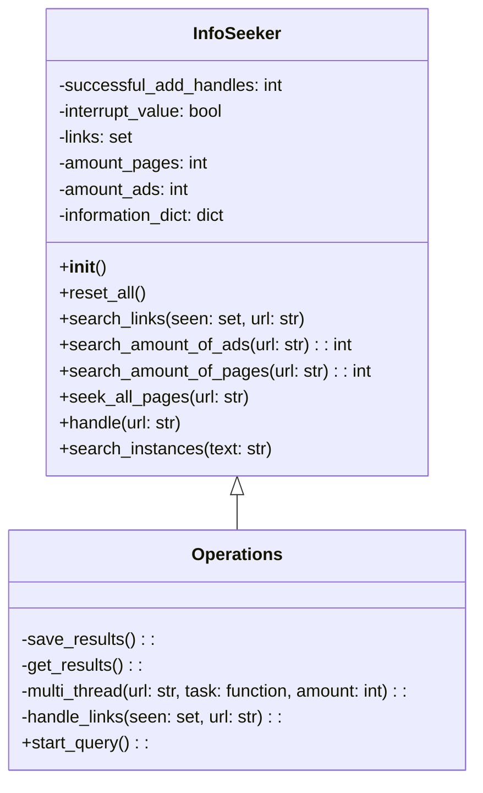

# Arkkitehtuuri

```mermaid
classDiagram
    class InfoSeeker{
        -successful_add_handles: int
        -interrupt_value: bool
        -links: set
        -amount_pages: int
        -amount_ads: int
        -information_dict: dict
        +__init__()
        +reset_all()
        +search_links(seen: set, url: str)
        +search_amount_of_ads(url: str): int
        +search_amount_of_pages(url: str): int
        +seek_all_pages(url: str)
        +handle(url: str)
        +search_instances(text: str)
    }
    class Operations{
        -save_results():
        -get_results():
        -multi_thread(url: str, task: function, amount: int):
        -handle_links(seen: set, url: str):
        +start_query():
    }

    InfoSeeker <|-- Operations
    
```
    
